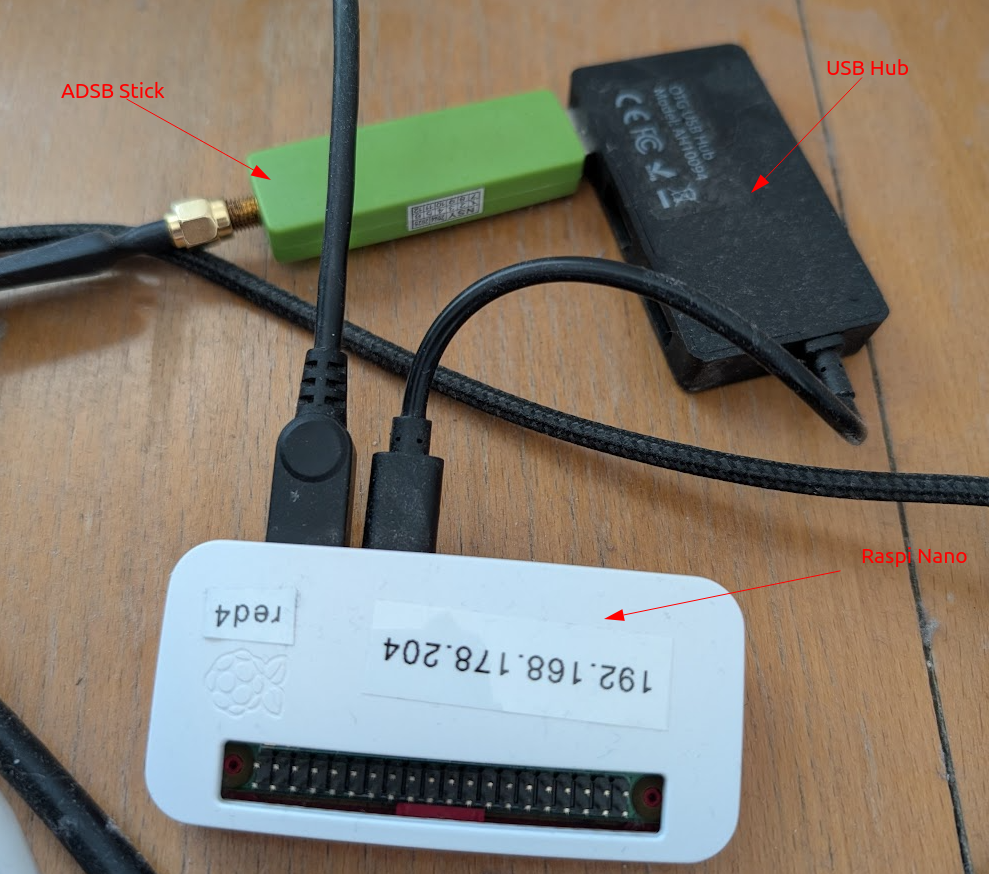
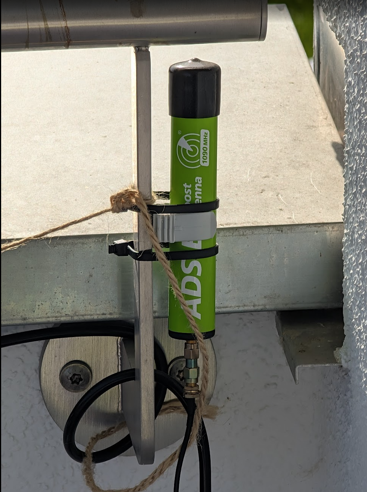

# Airplanes

This is a real-time stream of airplane positions based on SBS1 data above my home. Here are the 
currently detected airplanes (updated live):

<WorldMap>
 <Markers topic="stefan/airplanes/flights/+/location" />
</WorldMap>

The data is collected via an ADSB stick. Here is an image of the ADSB stick connected
to a Raspberry Pi Nano.



The Rasberry Pi is running [dump1090-fa](https://github.com/edgeofspace/dump1090-fa). 

Here is the antenna on the balcony.



Without the antenna, it did not work at all.

The data is forwarded to [adsbhub.org](adsbhub.org). 

## Topics

The following topics are available:

- `stefan/airplanes/flights/${callsign}/location`: The current location of the airplane with the given callsign, in the format "latitude,longitude".
- `stefan/airplanes/stats/flights_seen_in_last_15m`: The number of flights seen in the last 15 minutes.
- `stefan/airplanes/stats/queue_size`: The current size of the location queue.
- `stefan/airplanes/stats/messages_per_minute`: The number of messages published per minute.

Here is an example MQTT message for a flight location:

```
51.5074,-0.1278
```

This represents a latitude of 51.5074 and a longitude of -0.1278.

